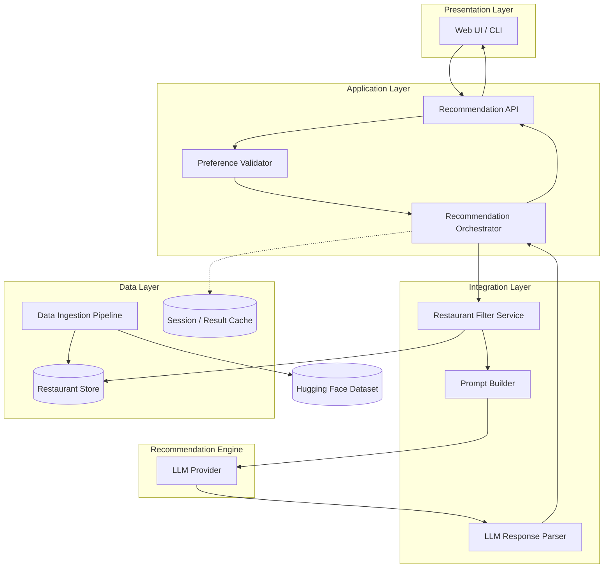
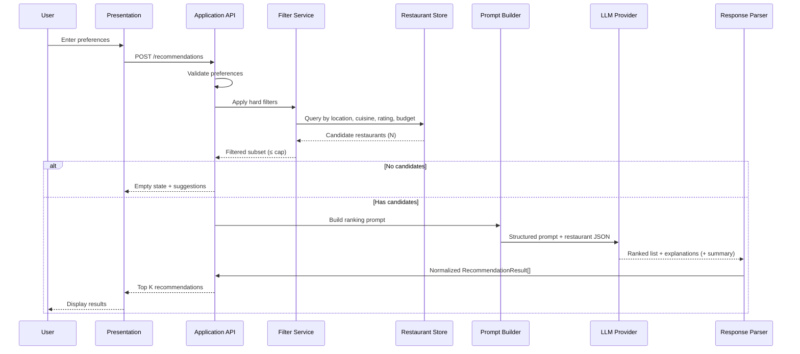
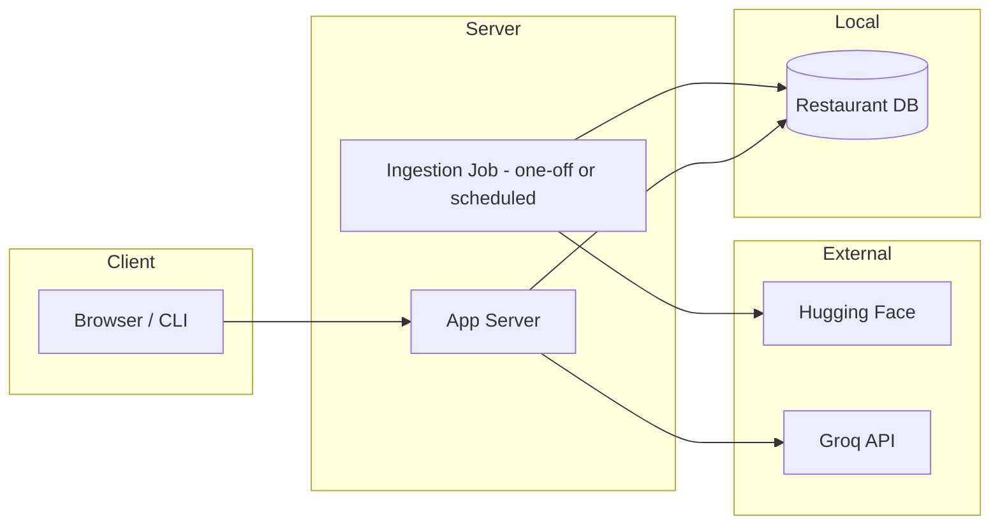

# Architecture: AI-Powered Restaurant Recommendation System

This document defines the technical architecture for the Zomato-inspired restaurant recommendation service. It is derived from [`docs/context.md`](context.md) and the original [`docs/ProblemStatement`](ProblemStatement).

---

## 1. Purpose and Scope

### 1.1 What We Are Building

A system that:

1. Ingests and normalizes restaurant data from Hugging Face
2. Captures structured user preferences
3. Filters candidates before LLM invocation (cost and latency control)
4. Uses an LLM to rank, explain, and optionally summarize recommendations
5. Presents structured results plus natural-language rationale

### 1.2 Architectural Goals

| Goal | How the architecture supports it |
|------|----------------------------------|
| Relevance | Hard filters on location, cuisine, rating, budget before LLM |
| Explainability | LLM produces per-restaurant explanations tied to user prefs |
| Performance | Cache dataset locally; cap restaurants sent to LLM (e.g. top 20–50) |
| Maintainability | Clear layer boundaries: data, application, LLM, presentation |
| Extensibility | Groq-backed LLM with provider abstraction; optional vector search later |

### 1.3 Out of Scope (v1)

Per context: authentication, multi-tenant accounts, production SLAs, A/B testing, and formal evaluation pipelines are not required unless added later.

---

## 2. High-Level Architecture

### 2.1 Logical View



### 2.2 Request Flow (End-to-End)



---

## 3. Layer-by-Layer Design

### 3.1 Data Layer

#### 3.1.1 Responsibilities

- Download dataset from [ManikaSaini/zomato-restaurant-recommendation](https://huggingface.co/datasets/ManikaSaini/zomato-restaurant-recommendation)
- Clean, type-cast, and map raw columns to internal schema
- Persist for fast repeated queries (avoid re-downloading on every request)

#### 3.1.2 Ingestion Pipeline

| Stage | Actions |
|-------|---------|
| Load | `datasets.load_dataset(...)` or equivalent HTTP fetch |
| Select | Keep: name, location/city, cuisines, approximate cost, rating, and any tags useful for “additional preferences” |
| Normalize | Trim strings; parse rating as float; map cost to `low` / `medium` / `high` buckets; extract raw neighborhood/locality for `city`; deduplicate by `(name, city)` keeping the highest-rated entry |
| Validate | Drop rows missing name, location, or rating; log counts |
| Persist | Write to SQLite database |

#### 3.1.3 Canonical Data Model

```text
Restaurant {
  id: string              # stable row id
  name: string
  city: string            # neighborhood / locality name (e.g. Indiranagar, Bellandur)
  cuisines: string[]      # split from multi-value field
  rating: float           # e.g. 0.0–5.0
  cost_for_two: int?      # raw numeric if available
  budget_tier: enum       # low | medium | high
  metadata: object        # optional: address, votes, etc.
}
```

#### 3.1.4 Storage Options

| Option | When to use |
|--------|-------------|
| In-memory DataFrame | Prototypes, small dataset, single process |
| SQLite / DuckDB | Local app, simple queries, no extra infra |
| PostgreSQL | Multi-user deployment, concurrent reads |

**Recommendation for v1:** SQLite or Parquet + Pandas/Polars for simplicity.

---

### 3.2 Application Layer

#### 3.2.1 Preference Model

```text
UserPreferences {
  location: string          # required
  budget: low | medium | high
  cuisine: string           # required or strongly encouraged
  min_rating: float         # default e.g. 3.5
  additional: string[]      # e.g. "family-friendly", "quick service"
  top_k: int                # default 5
}
```

#### 3.2.2 Validation Rules

| Field | Rule |
|-------|------|
| `location` | Non-empty; matched against known cities after normalization |
| `budget` | One of enumerated tiers |
| `cuisine` | Non-empty or “any” with wider filter |
| `min_rating` | 0.0–5.0 |
| `additional` | Free text or predefined tags; passed through to LLM prompt |

#### 3.2.3 Recommendation Orchestrator

Central coordinator:

1. Validate `UserPreferences`
2. Invoke **Filter Service** → candidate list
3. If empty → return structured empty response (no LLM call)
4. Truncate to `MAX_CANDIDATES_FOR_LLM` (e.g. 30)
5. Build prompt → call LLM → parse response
6. Merge LLM rankings with canonical `Restaurant` fields for display
7. Return `RecommendationResponse`

---

### 3.3 Integration Layer

#### 3.3.1 Filter Service (Pre-LLM)

Hard filters reduce token usage and improve relevance.

| Preference | Filter logic |
|------------|--------------|
| Location | `city` equals or contains user location (case-insensitive) |
| Cuisine | Restaurant `cuisines` contains requested cuisine |
| Min rating | `rating >= min_rating` |
| Budget | `budget_tier` matches or is adjacent tier (optional soft match) |

**Ordering before LLM:** Sort by rating desc, then cost alignment, then take top N.

#### 3.3.2 Prompt Builder

Constructs a deterministic prompt template:

- **System:** Role as restaurant expert; output JSON only (or structured blocks)
- **User context:** Serialized preferences
- **Data:** Compact JSON array of candidates (id, name, city, cuisines, rating, budget_tier)
- **Instructions:** Rank top K; explain each; optional one-paragraph summary

Example instruction block:

```text
Given USER_PREFERENCES and RESTAURANTS_JSON:
1. Rank the best matches (1 = best).
2. For each selected restaurant, write 1–2 sentences explaining the fit.
3. Optionally provide a brief overall summary.
Return valid JSON: { "ranked": [...], "summary": "..." }
```

#### 3.3.3 LLM Response Parser

- Parse JSON; validate schema
- Map `restaurant_id` back to full `Restaurant` records
- On parse failure: retry once with “fix JSON” prompt, or fall back to rating-based order without AI explanations

---

### 3.4 Recommendation Engine (LLM via Groq)

**v1 provider:** [Groq](https://console.groq.com/) — fast inference for chat completions, used for ranking, explanations, and optional summaries. OpenAI is not used in this project.

#### 3.4.1 Responsibilities

| Task | Owner |
|------|--------|
| Semantic ranking among similar candidates | Groq LLM |
| Natural-language explanations | Groq LLM |
| Optional summary of choices | Groq LLM |
| Hard constraint enforcement (city, min rating) | Filter Service (not LLM alone) |

#### 3.4.2 Provider Abstraction

```text
LLMProvider (interface)
  - complete(prompt: string, options?: LLMOptions) -> str
  - complete_structured(prompt, schema) -> parsed object  # if supported
```

**v1 implementations:**

| Implementation | Use |
|----------------|-----|
| `GroqProvider` | Production and local dev (requires `GROQ_API_KEY`) |
| `MockLLMProvider` | Unit/integration tests without network |

`GroqProvider` calls the Groq Chat Completions API via the official `groq` Python SDK (or the OpenAI-compatible client pointed at `https://api.groq.com/openai/v1`).

#### 3.4.3 Groq configuration

| Variable | Purpose | Example |
|----------|---------|---------|
| `GROQ_API_KEY` | API authentication ([Groq Console](https://console.groq.com/keys)) | `gsk_...` |
| `GROQ_MODEL` | Groq model id | `llama-3.3-70b-versatile` |
| `GROQ_BASE_URL` | Optional API base (default Groq OpenAI-compatible URL) | `https://api.groq.com/openai/v1` |

**Suggested models (Groq):**

| Model | When to use |
|-------|-------------|
| `llama-3.3-70b-versatile` | Default — strong reasoning for rank + explain |
| `llama-3.1-8b-instant` | Faster/cheaper smoke tests |
| `mixtral-8x7b-32768` | Alternative if quota limits hit |

#### 3.4.4 Runtime parameters

| Parameter | Typical value |
|-----------|----------------|
| Temperature | 0.2–0.5 (more deterministic ranking) |
| Max tokens | Sized for K restaurants × explanation length |
| Timeout | 30–60s with user-facing message on failure |

#### 3.4.5 Cost and Latency Controls

- Never send full dataset to LLM—only filtered cap (e.g. ≤ 30 rows)
- Truncate long cuisine lists in prompt
- Cache identical preference + filter hash → response (optional)

---

### 3.5 Presentation Layer

#### 3.5.1 Responsibilities

- Form for location, budget, cuisine, min rating, additional notes
- Loading and error states
- Results cards: name, cuisine, rating, cost, AI explanation
- Optional summary section at top

#### 3.5.2 API Contract (REST Example)

**Request**

```http
POST /api/v1/recommendations
Content-Type: application/json

{
  "location": "Bangalore",
  "budget": "medium",
  "cuisine": "Italian",
  "min_rating": 4.0,
  "additional": ["family-friendly"],
  "top_k": 5
}
```

**Response**

```json
{
  "preferences": { "...": "echo validated input" },
  "summary": "Optional LLM overview of picks.",
  "recommendations": [
    {
      "rank": 1,
      "restaurant": {
        "id": "123",
        "name": "Example Bistro",
        "city": "Bangalore",
        "cuisines": ["Italian", "Continental"],
        "rating": 4.5,
        "budget_tier": "medium",
        "estimated_cost_display": "₹800 for two"
      },
      "explanation": "Strong Italian menu and rating above your minimum..."
    }
  ],
  "meta": {
    "candidates_considered": 28,
    "llm_provider": "groq",
    "llm_model": "llama-3.3-70b-versatile"
  }
}
```

#### 3.5.3 UI Options

| Surface | Pros |
|---------|------|
| Streamlit | Fastest path for demos and coursework |
| React + FastAPI | Closer to production patterns |
| CLI | Scriptable testing without UI |

---

## 4. Component Diagram (Deployment Units)



**v1 deployment:** Single process (e.g. Streamlit monolith) or App + SQLite on one machine. Split ingestion into a CLI command: `python -m app.ingest`.

---

## 5. Module Structure (Suggested Repository Layout)

```text
zomato-recommender/
├── docs/
│   ├── ProblemStatement
│   ├── context.md
│   └── Architecture.md          # this file
├── data/
│   └── .gitkeep                 # local parquet/sqlite (gitignored)
├── src/
│   ├── data/
│   │   ├── ingest.py            # HF load + normalize + persist
│   │   ├── models.py            # Restaurant, UserPreferences
│   │   └── repository.py        # query by filters
│   ├── services/
│   │   ├── filter.py            # pre-LLM filtering
│   │   ├── prompt.py            # prompt templates
│   │   ├── llm.py               # GroqProvider + MockLLMProvider
│   │   └── recommender.py       # orchestrator
│   ├── api/
│   │   ├── routes.py            # REST endpoints (if used)
│   │   └── schemas.py           # request/response DTOs
│   └── app/
│       ├── main.py              # entry (Streamlit / FastAPI)
│       └── ui.py                # presentation components
├── scripts/
│   └── ingest_dataset.py
├── tests/
│   ├── test_filter.py
│   └── test_prompt_parser.py
├── .env.example                 # GROQ_API_KEY, GROQ_MODEL
└── requirements.txt             # includes groq
```

---

## 6. Cross-Cutting Concerns

### 6.1 Error Handling

| Failure | Behavior |
|---------|----------|
| Dataset missing | Run ingestion; show admin message |
| No filter matches | 200 with empty list + “broaden criteria” hints |
| Groq timeout / 5xx / rate limit (429) | Retry once with backoff; fallback to rating-sorted list without explanations |
| Invalid LLM JSON | Retry with repair prompt; log raw response |

### 6.2 Logging and Observability

- Log: preference hash, candidate count, LLM latency, token usage (if available)
- Do not log full API keys or raw PII beyond session needs

### 6.3 Security

- Store `GROQ_API_KEY` in environment variables, never in source control
- Validate and sanitize all user inputs (length limits on `additional`)
- Rate-limit public API if deployed online

### 6.4 Configuration

| Variable | Purpose |
|----------|---------|
| `HF_DATASET_NAME` | Dataset id on Hugging Face |
| `DATABASE_PATH` | Local SQLite/Parquet path |
| `GROQ_API_KEY` | Groq API authentication |
| `GROQ_MODEL` | Groq model id (e.g. `llama-3.3-70b-versatile`) |
| `GROQ_BASE_URL` | Optional; defaults to Groq OpenAI-compatible endpoint |
| `MAX_CANDIDATES_FOR_LLM` | Cap before prompt |
| `DEFAULT_TOP_K` | Default recommendations returned |

---

## 7. Data Flow Summary

```text
[Hugging Face] 
    → ingest → normalize → [Restaurant Store]
                                    ↑
[User] → [UI] → preferences → [Filter] ─┘
                    ↓
              candidates (≤ N)
                    ↓
              [Prompt Builder] → [LLM] → [Parser]
                    ↓
              [Merge with Restaurant records]
                    ↓
              [UI: name, cuisine, rating, cost, explanation]
```

---

## 8. Design Decisions (ADR Summary)

| Decision | Choice | Rationale |
|----------|--------|-----------|
| Filter before LLM | Yes | Enforces constraints; reduces cost and hallucination risk |
| LLM provider | Groq | Fast inference; project standard for Phase 4+ |
| Structured LLM output | JSON schema | Easier to merge with DB fields and render UI |
| Local persistence | SQLite/Parquet | Dataset is static enough for v1; no live HF calls per request |
| Single orchestrator | `RecommendationService` | One place for empty-state, cap, and fallback logic |
| Budget as tier enum | low/medium/high | Matches problem statement; map from numeric cost in ingestion |

---

## 9. Testing Strategy

| Layer | Test focus |
|-------|------------|
| Ingestion | Row counts, required fields, budget tier mapping |
| Filter | Location/cuisine/rating/budget combinations; empty results |
| Prompt | Snapshot tests for template with fixed inputs |
| Parser | Valid/invalid JSON; partial LLM responses |
| E2E | Mock LLM; verify API returns ranked list with explanations |

---

## 10. Evolution Path (Post-v1)

| Enhancement | Architectural impact |
|-------------|------------------------|
| Semantic search over reviews | Add embedding index; hybrid retrieve + LLM rerank |
| User accounts & history | Auth service; preference store; personalized prompts |
| Streaming explanations | SSE from LLM through API to UI |
| Evaluation harness | Golden preference sets; compare LLM vs baseline ranking |
| Caching layer | Redis for recommendation responses |

---

## 11. Success Criteria Mapping

From [`docs/context.md`](context.md):

| Criterion | Architectural mechanism |
|-----------|-------------------------|
| Preferences reflected in results | Filter service + explicit prefs in LLM prompt |
| Readable explanations | LLM instruction template; per-item `explanation` field |
| Comparable structured output | `Restaurant` DTO in every recommendation item |
| Full pipeline | Ingest → UI → filter → LLM → display (Sections 2–3) |

---

## 12. References

- Project context: [`docs/context.md`](context.md)
- Problem statement: [`docs/ProblemStatement`](ProblemStatement)
- Dataset: https://huggingface.co/datasets/ManikaSaini/zomato-restaurant-recommendation
