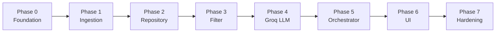

# Phase-Wise Implementation Plan

This plan translates [`docs/context.md`](context.md) and [`docs/Architecture.md`](Architecture.md) into ordered build phases. Each phase has goals, tasks, deliverables, acceptance criteria, and dependencies.

---

## Overview

| Phase | Name | Maps to (context workflow) | Primary output |
|-------|------|----------------------------|----------------|
| 0 | Foundation & setup | — | Runnable repo, config, tooling |
| 1 | Data ingestion & store | §1 Data Ingestion | Local restaurant database |
| 2 | Domain models & repository | Data layer (Arch §3.1) | Queryable `Restaurant` records |
| 3 | Preferences & filtering | §2 User Input + §3 Integration (filter) | Validated prefs + candidate subset |
| 4 | LLM recommendation engine (Groq) | §3 Integration (prompt) + §4 Engine | Ranked results with explanations |
| 5 | Orchestration & API | Application layer (Arch §3.2) | End-to-end recommendation service |
| 6 | Presentation layer | §5 Output Display | User-facing app |
| 7 | Hardening & release | Cross-cutting (Arch §6, §9) | Tested, demo-ready v1 |

**Suggested stack (v1):** Python 3.11+, `datasets` + Pandas, SQLite, Streamlit UI, **Groq** for LLM inference (`groq` SDK).

---

## Phase 0: Foundation & Project Setup

**Goal:** Establish repository structure, dependencies, and configuration so later phases plug in cleanly.

**Depends on:** Nothing.

### Tasks

| # | Task | Reference |
|---|------|-----------|
| 0.1 | Create folder layout per Architecture §5 (`src/`, `data/`, `tests/`, `scripts/`) | Arch §5 |
| 0.2 | Add `requirements.txt` (`datasets`, `pandas`, `pydantic`, `python-dotenv`, `groq`, `streamlit`, `pytest`) | — |
| 0.3 | Add `.env.example` with `HF_DATASET_NAME`, `DATABASE_PATH`, `GROQ_API_KEY`, `GROQ_MODEL`, `MAX_CANDIDATES_FOR_LLM`, `DEFAULT_TOP_K` | Arch §6.4 |
| 0.4 | Add `.gitignore` for `data/*.db`, `.env`, `__pycache__` | — |
| 0.5 | Implement `src/config.py` to load env vars with defaults | Arch §6.4 |
| 0.6 | Add minimal `README` with setup: venv, install, ingest, run app | — |

### Deliverables

- Empty module stubs: `src/data/`, `src/services/`, `src/app/`
- `pytest` runs (zero or placeholder tests)
- Documented local run instructions

### Acceptance criteria

- [ ] `pip install -r requirements.txt` succeeds
- [ ] Config reads from `.env` without crashing when keys are missing (clear errors for required `GROQ_API_KEY` at LLM runtime only)
- [ ] Repo layout matches Architecture §5

**Estimated effort:** 0.5–1 day

---

## Phase 1: Data Ingestion Pipeline

**Goal:** Load the Hugging Face Zomato dataset, normalize it, and persist locally (no per-request HF download).

**Depends on:** Phase 0.

**Maps to:** Context §1 Data Ingestion; Architecture §3.1.2.

### Tasks

| # | Task | Details |
|---|------|---------|
| 1.1 | Implement `scripts/ingest_dataset.py` CLI entry point | `python scripts/ingest_dataset.py` |
| 1.2 | Load dataset via `datasets.load_dataset("ManikaSaini/zomato-restaurant-recommendation")` | Context data source |
| 1.3 | Inspect raw schema; document column mapping in code comments | Adapt to actual HF columns |
| 1.4 | Select & rename fields → `name`, `city`, `cuisines`, `rating`, `cost_for_two` | Arch §3.1.2 |
| 1.5 | Normalize: trim strings, parse rating float, split cuisines (comma-separated → list), extract neighborhood/locality for `city`, and deduplicate by `(name, city)` | Arch §3.1.2 |
| 1.6 | Map `cost_for_two` → `budget_tier` (`low` / `medium` / `high`) using percentile or fixed thresholds | Arch §8 ADR |
| 1.7 | Assign stable `id` per row; drop rows missing name, city, or rating | Arch §3.1.2 |
| 1.8 | Persist to SQLite at `DATABASE_PATH` (table `restaurants`) | Arch §3.1.4 |
| 1.9 | Log ingestion stats: total rows, dropped rows, cities count | Arch §6.2 |

### Deliverables

- `src/data/ingest.py` — load, normalize, persist
- `data/restaurants.db` (gitignored) after first run
- Ingestion log output

### Acceptance criteria

- [ ] CLI completes without error on first run
- [ ] DB contains > 0 restaurants with non-null `name`, `city`, `rating`
- [ ] Every row has `budget_tier` in `{low, medium, high}`
- [ ] Re-running ingest is idempotent and database contains no duplicates for the same restaurant name and neighborhood/locality

### Tests (Phase 1)

- `tests/test_ingest.py`: budget tier mapping, required fields present, row count > threshold

**Estimated effort:** 1–2 days

---

## Phase 2: Domain Models & Repository

**Goal:** Define canonical types and expose filter-friendly queries over the local store.

**Depends on:** Phase 1.

**Maps to:** Architecture §3.1.3, §3.1.4.

### Tasks

| # | Task | Details |
|---|------|---------|
| 2.1 | Define `Restaurant` Pydantic/dataclass model | Arch §3.1.3 |
| 2.2 | Define `UserPreferences` and `BudgetTier` enum | Arch §3.2.1 |
| 2.3 | Implement `src/data/repository.py`: `get_all()`, `get_by_city()`, `list_cities()` | — |
| 2.4 | Add repository method `query_candidates(location, cuisine, min_rating, budget)` returning `list[Restaurant]` | Arch §3.3.1 |
| 2.5 | Handle DB-missing case with clear `DatasetNotFoundError` + message to run ingest | Arch §6.1 |

### Deliverables

- `src/data/models.py`
- `src/data/repository.py`
- Unit tests for repository queries

### Acceptance criteria

- [ ] Repository returns only restaurants matching city (case-insensitive)
- [ ] Cuisine filter matches if any cuisine in list contains user input
- [ ] `min_rating` filter applied correctly
- [ ] `list_cities()` usable for UI dropdown validation

### Tests (Phase 2)

- `tests/test_repository.py`: filter combinations, empty city, unknown city

**Estimated effort:** 1 day

---

## Phase 3: Preference Validation & Filter Service

**Goal:** Validate user input and produce a capped, sorted candidate list before any LLM call.

**Depends on:** Phase 2.

**Maps to:** Context §2 User Input, §3 Integration (filter); Architecture §3.2.2, §3.3.1.

### Tasks

| # | Task | Details |
|---|------|---------|
| 3.1 | Implement `PreferenceValidator` in `src/services/validation.py` | Arch §3.2.2 |
| 3.2 | Validate `location` against known cities (from repository) with helpful error | — |
| 3.3 | Validate `budget`, `min_rating` range, `top_k` bounds | — |
| 3.4 | Implement `src/services/filter.py`: apply hard filters via repository | Arch §3.3.1 |
| 3.5 | Sort candidates: rating desc, then budget alignment | Arch §3.3.1 |
| 3.6 | Truncate to `MAX_CANDIDATES_FOR_LLM` (config, default 30) | Arch §3.4.4 |
| 3.7 | Return structured empty result when zero candidates (no LLM) | Arch §6.1 |
| 3.8 | Add CLI script `scripts/test_filter.py` for manual smoke test | — |

### Deliverables

- `src/services/validation.py`
- `src/services/filter.py`
- Filter tests + sample CLI

### Acceptance criteria

- [ ] Invalid preferences raise validation errors with field-level messages
- [ ] Valid Bangalore + Italian + rating 4.0 returns non-empty list when data exists
- [ ] Impossible combo returns empty list without exception
- [ ] Output length ≤ `MAX_CANDIDATES_FOR_LLM`

### Tests (Phase 3)

- `tests/test_filter.py`: each filter dimension, empty results, cap enforcement

**Estimated effort:** 1 day

---

## Phase 4: LLM Integration (Groq — Prompt, Provider, Parser)

**Goal:** Rank filtered restaurants, generate explanations and optional summary via **Groq** with structured JSON output.

**Depends on:** Phase 3 (needs sample candidates for prompt tuning).

**Maps to:** Context §3 Integration (prompt), §4 Recommendation Engine; Architecture §3.3.2–3.4.5.

**Prerequisites:**

- Groq account and API key from [Groq Console](https://console.groq.com/keys)
- Set in `.env`: `GROQ_API_KEY`, `GROQ_MODEL` (default `llama-3.3-70b-versatile`)

### Tasks

| # | Task | Details |
|---|------|---------|
| 4.1 | Define `LLMProvider` protocol in `src/services/llm.py` | Arch §3.4.2 |
| 4.2 | Implement `GroqProvider` using `groq` SDK (`client.chat.completions.create`) | Arch §3.4.3 |
| 4.3 | Add `GROQ_API_KEY`, `GROQ_MODEL`, optional `GROQ_BASE_URL` to `src/config.py` | Arch §6.4 |
| 4.4 | Implement `src/services/prompt.py`: system + user template with prefs + compact JSON candidates | Arch §3.3.2 |
| 4.5 | Define expected JSON schema: `{ "ranked": [{ "restaurant_id", "rank", "explanation" }], "summary": "..." }` | Arch §3.3.2 |
| 4.6 | Implement `src/services/parser.py`: parse JSON, validate schema, map ids → `Restaurant` | Arch §3.3.3 |
| 4.7 | On parse failure: one retry with “return valid JSON only”; then fallback | Arch §6.1 |
| 4.8 | Fallback: rating-sorted top K with generic explanation string | Arch §6.1 |
| 4.9 | Implement `MockLLMProvider` for tests (no Groq network call) | Arch §9 |
| 4.10 | Handle Groq errors: 401 (bad key), 429 (rate limit), timeout — retry then fallback | Arch §6.1 |
| 4.11 | Tune temperature (0.2–0.5) and max tokens; log latency and model id | Arch §3.4.4 |

### Deliverables

- `src/services/llm.py` (`GroqProvider`, `MockLLMProvider`)
- `src/services/prompt.py`, `parser.py`
- Updated `.env.example` with `GROQ_*` variables
- `groq` added to `requirements.txt`
- Working recommendation JSON from Groq or mock

### Acceptance criteria

- [ ] `GroqProvider` calls Groq chat completions with configured model
- [ ] Prompt includes user preferences and ≤ N candidate restaurants
- [ ] Parser produces `rank`, `restaurant`, `explanation` for each item
- [ ] Invalid Groq/JSON response triggers retry then fallback (no crash)
- [ ] `summary` field populated when Groq complies; optional when empty
- [ ] Mock tests pass without `GROQ_API_KEY`
- [ ] Response `meta` includes `llm_provider: "groq"` and `llm_model`

### Tests (Phase 4)

- `tests/test_prompt.py`: snapshot of prompt structure for fixed inputs
- `tests/test_parser.py`: valid JSON, malformed JSON, missing ids
- `tests/test_llm_integration.py`: optional live Groq call, gated by `RUN_LLM_TESTS=1` and `GROQ_API_KEY`

**Estimated effort:** 2–3 days

---

## Phase 5: Recommendation Orchestrator & API Contract

**Goal:** Wire validation → filter → LLM → merge into a single service and optional REST layer.

**Depends on:** Phases 3 and 4.

**Maps to:** Architecture §3.2.3, §3.5.2; Context end-to-end flow.

### Tasks

| # | Task | Details |
|---|------|---------|
| 5.1 | Implement `RecommendationService` in `src/services/recommender.py` | Arch §3.2.3 |
| 5.2 | Orchestrator steps: validate → filter → empty check → prompt → LLM → parse → merge | Arch §3.2.3 |
| 5.3 | Build `RecommendationResponse` with `preferences`, `summary`, `recommendations`, `meta` | Arch §3.5.2 |
| 5.4 | Add `estimated_cost_display` from `cost_for_two` (e.g. “₹{n} for two”) | Context §5 output |
| 5.5 | Define `src/api/schemas.py` request/response DTOs (Pydantic) | Arch §3.5.2 |
| 5.6 | Optional: FastAPI `POST /api/v1/recommendations` in `src/api/routes.py` | Arch §3.5.2 |
| 5.7 | CLI: `scripts/get_recommendations.py` accepting JSON prefs | — |

### Deliverables

- `src/services/recommender.py`
- `src/api/schemas.py` (+ `routes.py` if FastAPI chosen)
- CLI or API callable end-to-end without UI

### Acceptance criteria

- [ ] Single call returns top K with name, cuisine, rating, cost display, explanation
- [ ] Empty filter result returns 200-style response with hints (no LLM call)
- [ ] `meta.candidates_considered` reflects pre-LLM count
- [ ] Preferences echoed in response match validated input

### Tests (Phase 5)

- `tests/test_recommender.py`: E2E with `MockLLMProvider`, empty candidates, fallback path

**Estimated effort:** 1–2 days

---

## Phase 6: Presentation Layer (UI)

**Goal:** Collect preferences and display recommendations in a user-friendly format.

**Depends on:** Phase 5.

**Maps to:** Context §2 User Input, §5 Output Display; Architecture §3.5.

### Tasks

| # | Task | Details |
|---|------|---------|
| 6.1 | Choose UI: **Streamlit** (recommended v1) in `src/app/main.py` | Arch §3.5.3 |
| 6.2 | Preference form: location (selectbox from `list_cities()`), budget, cuisine, min rating slider | Context §2 |
| 6.3 | Additional preferences: text area or multi-select tags | Context §2 |
| 6.4 | “Get recommendations” button → call `RecommendationService` | — |
| 6.5 | Loading spinner during LLM call; timeout message on failure | Arch §6.1 |
| 6.6 | Results: optional summary banner + cards (name, cuisines, rating, cost, explanation) | Context §5 |
| 6.7 | Empty state: “No matches” + suggestions to broaden criteria | Arch §6.1 |
| 6.8 | Basic styling: headers, spacing, rank badges | — |

### Deliverables

- `src/app/main.py`, `src/app/ui.py` (optional split)
- Runnable: `streamlit run src/app/main.py`

### Acceptance criteria

- [ ] User can complete full flow without using CLI
- [ ] Each result card shows: name, cuisine, rating, estimated cost, AI explanation
- [ ] Invalid form input shows inline validation errors
- [ ] App works when DB exists and `GROQ_API_KEY` is set

**Estimated effort:** 1–2 days

---

## Phase 7: Hardening, Testing & Release

**Goal:** Production-quality v1 for demo/submission: tests, docs, error handling, README.

**Depends on:** Phase 6.

**Maps to:** Architecture §6, §9, §11; Context success criteria.

### Tasks

| # | Task | Details |
|---|------|---------|
| 7.1 | Run full `pytest` suite; fix failures; target critical path coverage | Arch §9 |
| 7.2 | Add structured logging (candidate count, LLM latency) | Arch §6.2 |
| 7.3 | Input sanitization: max length on `additional` text | Arch §6.3 |
| 7.4 | Verify `.env` never committed; document secrets setup | Arch §6.3 |
| 7.5 | Manual test matrix (see below) | — |
| 7.6 | Update README: architecture diagram link, phases, troubleshooting | — |
| 7.7 | Optional: record 2–3 min demo script / screenshots | — |
| 7.8 | Tag release `v1.0.0` or submission checkpoint | — |

### Manual test matrix

| Scenario | Expected |
|----------|----------|
| Popular city + common cuisine | ≥ 1 recommendation with explanation |
| Very high `min_rating` | Empty or few results; helpful empty state |
| Missing DB | Clear message to run ingest |
| Groq API down / invalid `GROQ_API_KEY` | Fallback or user-visible error |
| `additional` = “family-friendly” | Explanations mention family-friendly where plausible |

### Success criteria (from context)

| Criterion | Verified in |
|-----------|-------------|
| Preferences reflected in results | Phases 3, 4, 7 manual tests |
| Readable explanations | Phase 4 prompt + Phase 6 UI |
| Structured comparable output | Phases 5–6 |
| Full pipeline | Phase 7 E2E demo |

### Deliverables

- Green test suite
- Complete README
- Demo-ready application

**Estimated effort:** 1–2 days

---

## Timeline Summary

| Phase | Duration (estimate) | Cumulative |
|-------|-------------------|------------|
| 0 – Foundation | 0.5–1 d | ~1 d |
| 1 – Ingestion | 1–2 d | ~3 d |
| 2 – Repository | 1 d | ~4 d |
| 3 – Filter | 1 d | ~5 d |
| 4 – LLM (Groq) | 2–3 d | ~8 d |
| 5 – Orchestrator | 1–2 d | ~10 d |
| 6 – UI | 1–2 d | ~12 d |
| 7 – Hardening | 1–2 d | ~14 d |

**Total (solo developer):** roughly **10–14 working days** for a complete v1.

Phases 4 and 6 often overlap with prompt/UI iteration; Phases 5–6 can start UI mockups once orchestrator interface is stable.

---

## Milestone Checklist

Use this for progress tracking across the project:

- [ ] **M0:** Repo boots, config loads
- [ ] **M1:** Dataset ingested to SQLite
- [ ] **M2:** Filters return sensible candidates from CLI
- [ ] **M3:** Groq (or mock) returns parsed rankings
- [ ] **M4:** Orchestrator returns full `RecommendationResponse` via CLI/API
- [ ] **M5:** Streamlit UI demo end-to-end
- [ ] **M6:** Tests pass + README complete → **v1 ready**

---

## Phase-to-Architecture Mapping

| Architecture component | Implemented in phase |
|------------------------|----------------------|
| `ingest.py` | 1 |
| `models.py`, `repository.py` | 2 |
| `validation.py`, `filter.py` | 3 |
| `prompt.py`, `llm.py` (Groq), `parser.py` | 4 |
| `recommender.py`, `api/schemas.py` | 5 |
| `app/main.py`, `ui.py` | 6 |
| Tests, logging, security | 7 |

---

## Optional Post-v1 Phases (Not Required for v1)

Aligned with Architecture §10:

| Phase | Enhancement |
|-------|-------------|
| 8 | Response caching (preference hash → Redis or file cache) |
| 9 | FastAPI + React front end (replace Streamlit) |
| 10 | Embedding-based retrieval for `additional` preferences |
| 11 | Evaluation harness with golden queries |

---

## References

- [`docs/context.md`](context.md) — objectives, workflow, success criteria
- [`docs/Architecture.md`](Architecture.md) — layers, models, API contract, testing
- [`docs/ProblemStatement`](ProblemStatement) — original requirements
- Dataset: https://huggingface.co/datasets/ManikaSaini/zomato-restaurant-recommendation
